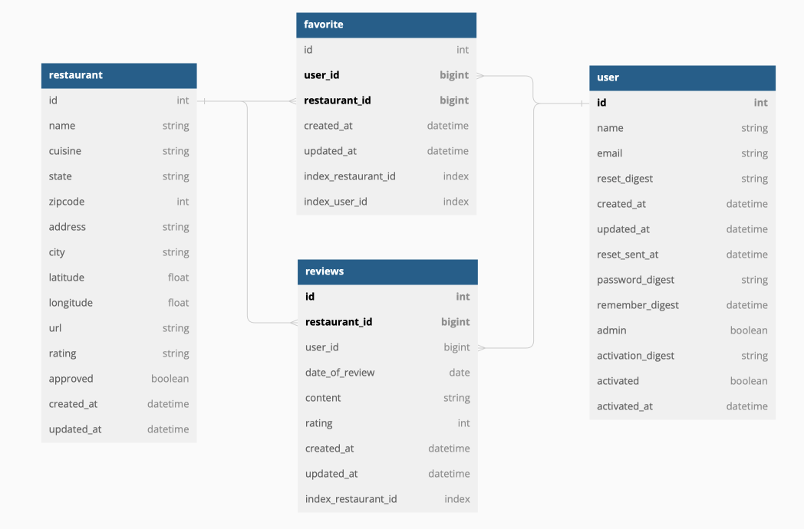
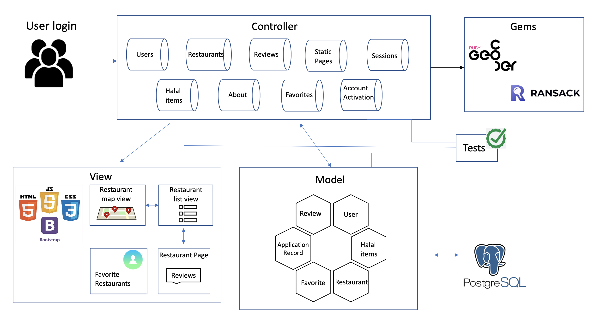

# Halal You Can Eat
Anjola Uprety, Elizabeth Diener, Fritz Duverglas, Syed Hassan, Zuhaeer Islam

### Product Summary

Finding a Halal restaurant is difficult and time consuming in the United States. Halal is a dietary restriction for Muslim community and finding a halal/zahiba options is a major pain point. In addition, there are many restaurants that may have part of their menu to be halal but isn’t considered a Halal restaurant in google search. Therefore, with this app we provide a solution for people wanting and craving halal food - specifically the Muslim Community in the United States.

### Functionality

<ul>
	<li>The app allows users to search and add Halal restaurants based on their location</li>
	<li>Users can filter restaurants based on cuisine, city, and name of the restaurant</li>
	<li>Users can add reviews and ratings for a specific restaurant, and have all of the favorite restaurants in one spot</li>
	<li>Basic sign in / sign up </li>
	<li>The restaurants appears in the map or  listed view and when they click they can view the location, cuisine, rating, website, and all the reviews written for that restaurant</li>
</ul>

### Schema

### Notable Technologies 

We worked with Google Map API (JavaScript) to implement the map with markers. The markers show the Halal restaurants around New York city. Users can scroll in the map to mark a Halal restaurant and the marker will be added once the restaurant has been approved by the admin. We also made an API controller for restaurants that way the restaurant can be added by the users which will show in the list of restaurants and in the google map once approved by the admin. In addition, we used Email API to authenticate the user's email that way every time they sign up the email will be sent to their email address for verification purposes. The interesting gems that we used in our apps were geocoder and ransack.

### Development/Deployment/Testing/Scaling Methodologies

In terms of development strategies, we made it so each task was properly given to the person who wanted to do it and knew enough about the topic to get it done. Also, based on the complexity of the task, we would either have one or two people working on the task, so that things are always progressing at a good pace. For automated deployment, we set up our heroku so that it would automatically deploy when there’s a new commit on the main branch. For automated testing, we used Github Actions to automatically run the testing process when we push to the main branch. When a commit is pushed, the tests automatically run and notify us if the tests fail, allowing us to check over what went wrong and fix anything before too much time has passed. In terms of scalability, there are certain parts of the code that would need to be adjusted to make things more efficient (restaurants, reviews) because when more objects are created, it could lead to the website slowing down if it’s not handled properly.

### Architecture

### Challenges

One of the hardest challenges of creating this application was getting Google Map API to work. We still have some issues with reloading the map as it is not directly displayed on the server. We also had some problems creating our own api and spent a few weeks trying to figure out if we should make a new rails app with an api flag or continue with an api controller. 

### Future Improvements

Everytime we return to the home page, we have issues with reloading the map and we hope to fix it in the future. In addition, we want to create categories for cuisines. We are still working on figuring out the account activation as it is currently not working for Brandeis email. In future we want to transfer this application to a mobile app which includes adding more javascript and fixing major css and html. We also want to add an additional point accumulator feature. The idea behind this feature is that users would be able to accumulate points on how often they interact with the app such as adding restaurants to favorites, leaving reviews or making a suggestion. The users would then be able to redeem points by getting discounts at restaurants. 

### Team Members

<ul>
	<li>Anjola Uprety - anjolauprety@brandeis.edu</li>
	<li>Elizabeth Diener - ejdiener@brandeis.edu</li>
	<li>Fritz Duverglas - fduverglas@brandeis.edu</li>
	<li>Syed Hassan - syedhassan@brandeis.edu</li>
	<li>Zuhaeer Islam - zuhaeerislam@brandeis.edu</li>
</ul>

### Reflection

Throughout this semester, we met weekly to discuss our progress and our goal for next week. During these meetings, we merged our changes into the main branch and resolved merge conflicts issues. We were able to thoroughly test our features and only push those to main. We learned to communicate effectively and work independently and in pairs depending on the complexity and size of our task. We utilized slack workspace for communication and trello to keep track of assignments and people responsible for the task. Everyone in the team was quick to respond in slack if anyone had questions regarding the project or if anyone had issues with code that someone else needed to look into. As a team we were also able to seek help from the TAs regarding testings, our feature implementation, and apis. Overally, it was a good experience working with the team and we are able to develop a software that we are really proud to present.

